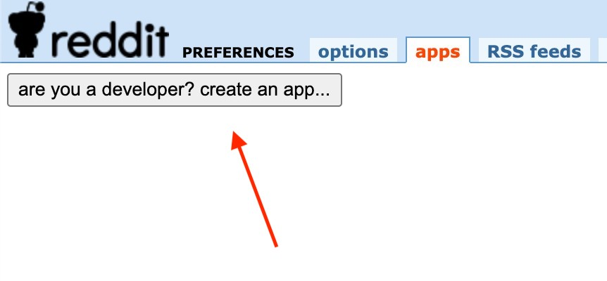
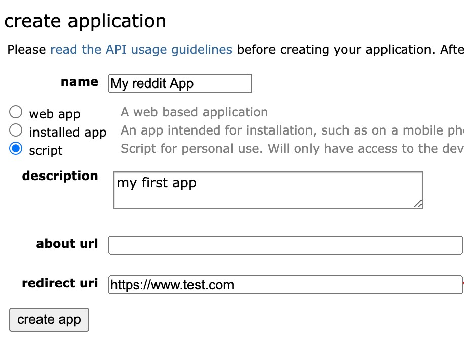
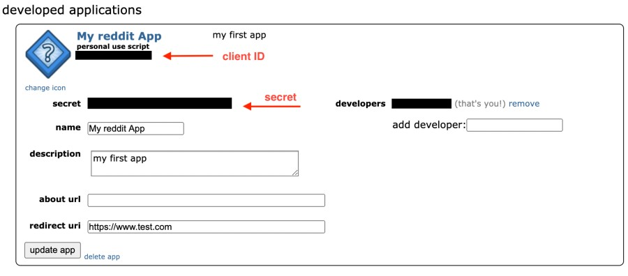

# Reddit Bots

 

This directory contains a (growing?) collection of Reddit bots that you may reuse freely.

## How to create a Reddit bot 101

**Summary** Reddit provides an _application programming interface_ (API) for interacting with its data. You will first need to [register an app](#creating-reddit-app) to obtain credentials to access that data. Then write (or reuse) a bot to do something with Reddit data. You can run bot locally on your own computer, or deploy to a web server to run the bot continuously.

## Detailed Steps

1. [Register an app](#creating-reddit-app)
2. [Configuring a bot](#configuring-a-bot)
3. [Run the bot](#run-the-bot)

### Creating Reddit app

1. Go to [Create an app...](https://ssl.reddit.com/prefs/apps/) (top left corner!) 

    

    
    

2. Enter some basic information about your app:

    - enter app **name**
    - choose **script** type
    - enter some basic **description**
    - **about URL** can be blank 
    - for **redirect URI** enter any valid URL (doesn't matter - we are not 
    using it but it is required)

    Something similar to what is shown below will work
    
    

    
    

3. Create app

    At this point you should see a page similar to the one below.
    Pay attention to your `client ID` and `secret`. Your bot will need these two values. Treat them like passwords and keep them secret at all times.
    
    

    
    

### Configuring a bot

**Prerequisites** the bots in this repository are written in Python. 
You should have some basic level understanding of this programming language and how to run Python programs. You should also have Python installed locally.

- TODO: add instructions

### Run the bot

- TODO: add instructions

 